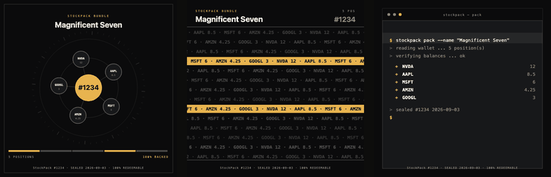
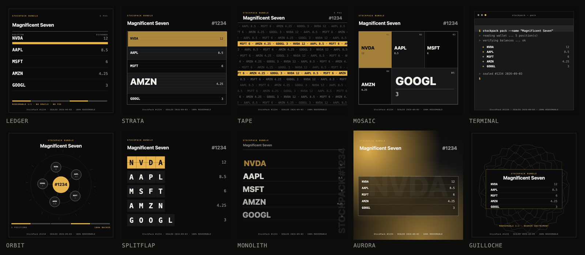
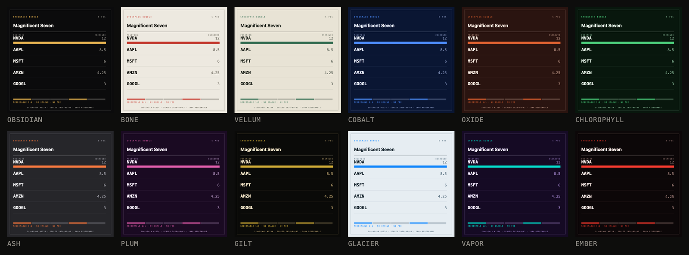
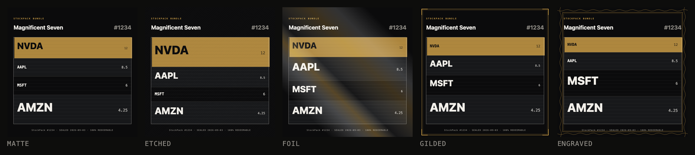
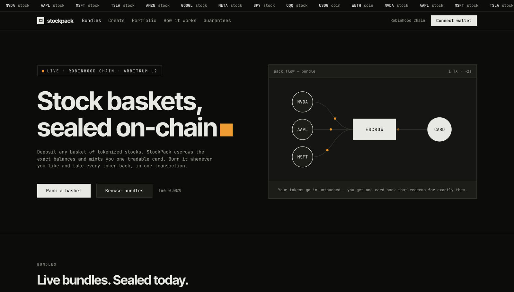

<div align="center">


# StockPack

### The on-chain ownership layer for tokenized equity

**Real-world assets, wrapped into a single composable primitive — settled on an Arbitrum Layer 2.**<br>
100% backed · redeemable 1:1 · no oracle · no fee · no admin over funds

`RWA` · `Tokenized equities` · `On-chain settlement layer` · `Arbitrum Layer 2` · `Composable primitive`

[](https://soliditylang.org)
[](https://getfoundry.sh)
[](#testing)
[](https://robinhood.com/us/en/chain/)
[](LICENSE)

[**Live dApp**](https://stock-pack.vercel.app) · [Rarity](web/content/nft-rarity.md) · [How the art works](web/content/nft-art.md) · [Architecture](docs/ARCHITECTURE.md)



<sub>Real output from the contract. Every frame is generated on-chain.</sub>

</div>

---

## The layer

Stock tokens are the **asset layer** — real-world equity, brought on-chain as ERC-20s.
StockPack is the **layer on top**: one ERC-721 that carries a whole portfolio, trades anywhere, and unwraps to the exact underlying at any moment.

Deposit `1 NVDA + 1 AAPL + 1 MSFT`. Get back a single token that escrows exactly those balances.

Whoever holds the card can burn it at any moment and withdraw every underlying token in one transaction. That is the entire product: **a hard, oracle-free redemption floor** wrapped in something you can trade on OpenSea.

```solidity
pack(name, tokens, amounts)   // → one card, balances sealed
unpack(tokenId)               // → burn it, take everything back
getBasket(tokenId)            // → verify the contents yourself, on-chain
```

No manager. No rebalancing. No preset weights. The basket is whatever you say it is, frozen at mint.

---

## What the contract *cannot* do

Most protocols tell you what they promise. These are the things StockPack is structurally incapable of — which is the only kind of promise worth reading.

| | |
| --- | --- |
| **Cannot be paused** | No owner, no pause flag, no upgrade path. Redemption has no gate anywhere in the contract. |
| **Cannot be drained by approvals** | Burning is strictly `ownerOf`-only. A standing marketplace `setApprovalForAll` can move the card, never destroy the basket. |
| **Cannot be mispriced** | No oracle is read on any path. A basket redeems for the units it was sealed with, whatever any feed says they are worth. |
| **Cannot be under-collateralised** | Deposits are checked by balance delta, so fee-on-transfer tokens are rejected at the door and `totalEscrowed` always matches what is held. |

Solvency is publicly checkable, always: `token.balanceOf(escrow) >= totalEscrowed(token)`.

---

## The card art

Every card is generated **on-chain at read time**. Nothing is uploaded, pinned, or stored on a server — `tokenURI` builds the whole SVG from scratch, so if the chain is running, your card renders.



Ten editions, weighted so rarity is legible:

| Edition | Odds | | Edition | Odds |
| --- | --- | --- | --- | --- |
| Ledger | 17.2% | | Orbit | 10.2% |
| Strata | 14.8% | | Splitflap | 8.6% |
| Tape | 13.3% | | Monolith | 6.3% |
| Mosaic | 12.5% | | Aurora | 3.9% |
| Terminal | 10.9% | | **Guilloche** | **2.3%** |

Crossed with **12 palettes** (four of them rare) and **5 finishes**, plus a derived **Tier** — Common / Uncommon / Rare / Mythic — computed from the combination rather than rolled separately, so the badge can never disagree with the picture.



Every trait is drawn from one seed: `keccak256(bundle name, creator)`. The **bundle name is the only input you control** — rename before sealing and the whole card rerolls, live in the preview. After minting it is fixed forever.

Full odds, counted directly out of the contract rather than restated from intent: **[Rarity →](web/content/nft-rarity.md)**

### It moves

Each edition animates the way its own geometry suggests — the Orbit satellites revolve while their tickers stay upright, the Tape runs, the Terminal cursor blinks, the Guilloche rosette turns. The CSS lives *inside* the SVG, so the card is alive in wallets and on marketplaces, not just on our site. A `prefers-reduced-motion` guard travels with it.



---

## Live deployments

**Mainnet — Robinhood Chain `4663`**

| | |
| --- | --- |
| dApp | **[stock-pack.vercel.app](https://stock-pack.vercel.app)** |
| Escrow | [`0x52BaEB…6ef387`](https://robinhoodchain.blockscout.com/address/0x52BaEB6b67Ca9ba9D168c7E63a6fFe81Da6ef387?tab=contract) |
| Renderer | [`0x04A7E7…797706`](https://robinhoodchain.blockscout.com/address/0x04A7E7600cD5532287D86d2b25249C2032797706?tab=contract) |
| Art | [`0x0FecCd…873878`](https://robinhoodchain.blockscout.com/address/0x0FecCd10121193E96254a12EB0dc79c00a873878?tab=contract) |
| Artist | `0x600f94…e603a8` — renderer pointer only; provably cannot touch funds |

**Testnet — Robinhood Chain `46630`** · escrow `0x52BaEB…6ef387` · renderer [`0x4fEB64…B204Bc`](https://explorer.testnet.chain.robinhood.com/address/0x4fEB6455A0cAD6bfE8A5a276A7e9247137B204Bc) · [faucet](https://faucet.testnet.chain.robinhood.com) (0.01 ETH + testnet Stock Tokens, 24 h)



---

## Architecture

The escrow is deliberately small and never grows. Everything that builds strings lives behind a swappable, view-only descriptor, so string-building bytecode can never push the core toward the EIP-170 limit.

```
StockPack.sol ............ the escrow. pack / unpack / emergencyUnpack / claim
   └── renderer (swappable, view-only, one-way lockable)
        └── StockPackRenderer .... base64 JSON, traits, previewSVG
             └── StockPackArt ..... trait selection, palettes, finishes
                  ├── ArtEditions ....... Ledger · Strata · Tape · Monolith
                  ├── ArtEditionsB ...... Mosaic · Terminal · Splitflap · Aurora · Guilloche
                  ├── ArtEditionsC ...... Orbit
                  ├── ArtCommon ......... geometry, palette type, shared chrome
                  └── ArtSVG ............ element primitives
```

Three edition libraries is not architecture astronomy — ten editions of SVG template measure well past **24,576 bytes** in one contract. Each is a linked library so the code lives in its own bytecode rather than inlining into the caller.

| Contract | Runtime bytes |
| --- | --- |
| StockPack | 10,002 |
| StockPackRenderer | 12,451 |
| StockPackArt | 15,769 |
| ArtEditions / B / C | 18,159 · 22,480 · 10,370 |
| ArtSVG | 4,507 |

Worst-case card: **9,923 bytes** of SVG (16 positions, 11-char symbols, 31-char name).

---

## Security model

1. **Redemption is strictly `ownerOf`-only.** ERC-721 approvals and operators are deliberately not honoured on any burn path — a standing marketplace approval can never destroy a basket. *(the NFT Trader / Gondi lesson)*
2. **Baskets are immutable after mint.** No top-ups, no partial withdrawals, no third-party interaction with an existing tokenId. What a buyer verifies cannot change before settlement.
3. **Fee-on-transfer tokens are rejected at deposit** by strict balance-delta equality, so the 1:1 claim is true for everything admitted.
4. **`emergencyUnpack` is the frozen-token escape hatch.** It makes zero external calls, so it structurally cannot revert on a poisoned or paused token. `claim()` is best-effort under shortfall. There is **no admin rescue**.
5. **`pack()` mints with `_mint`, not `_safeMint`** — no receiver callback. *(the Solv double-mint lesson)*
6. **The contract cannot verify that a token named "NVDA" is real.** The dApp validates against Robinhood's canonical registry and flags everything else; counterfeit tickers are abundant on this chain.

### Trust assumptions

Robinhood operates the sequencer and can censor any address, including this escrow. Robinhood Stock Tokens are pausable, upgradeable beacon proxies — the issuer can freeze or change token behaviour; `emergencyUnpack` is containment, not a cure. Stock Tokens are Jersey-issued debt securities restricted from US/UK/CA/CH/UAE persons.

---

## Testing

```bash
forge test                       # 60 unit / fuzz / renderer / adversarial tests + 4 invariants
forge test --match-contract RobinhoodFork --fork-url https://rpc.mainnet.chain.robinhood.com
forge build --sizes              # EIP-170 gate
```

Named invariants: `INV_SOLVENCY` · `INV_LEDGER` · `INV_REDEMPTION_FLOOR` (every live basket unpacks for exactly its recorded amounts — the product promise, executed) · `INV_SUPPLY` · `INV_NO_RESIDUAL` · `INV_MONOTONIC_IDS`

---

## Development

```bash
foundryup                        # Foundry v1.8.1, solc 0.8.36, OZ v5.7.0 — see VERSIONS.md
forge build && forge test

cd web && npm install && npm run dev      # Next.js + wagmi v3 + viem + RainbowKit
```

**Art tooling**

```bash
forge script script/RenderSamples.s.sol   # every edition × basket size → art-out/, with byte sizes
forge script script/RenderDocs.s.sol      # reference card per trait → web/public/art/
forge script script/RarityTable.s.sol     # exact odds, counted from the contract
```

**Deploying art**

The art sits behind the swappable renderer, so shipping it is a renderer upgrade. `DeployArt.s.sol` deploys the contracts from any funded wallet; the escrow's `artist` then signs a single `setRenderer` call. `lockRenderer()` freezes the pointer permanently — **deploy the art you want before calling it.**

---

## Docs

| | |
| --- | --- |
| [Rarity](web/content/nft-rarity.md) | Full trait tables and odds, counted from the contract |
| [How the art works](web/content/nft-art.md) | What decides your card, and what it guarantees |
| [Architecture](docs/ARCHITECTURE.md) | Contract layout and design decisions |
| [Product](docs/PRODUCT.md) | Why this exists |

---

<div align="center">
<sub>MIT · Nothing here is investment advice or an offer to buy or sell securities.</sub>
</div>
